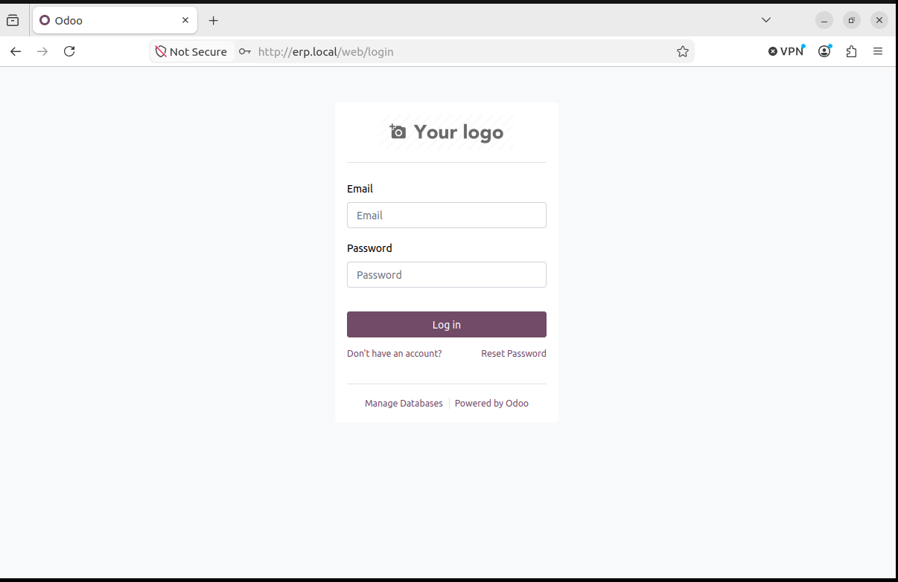
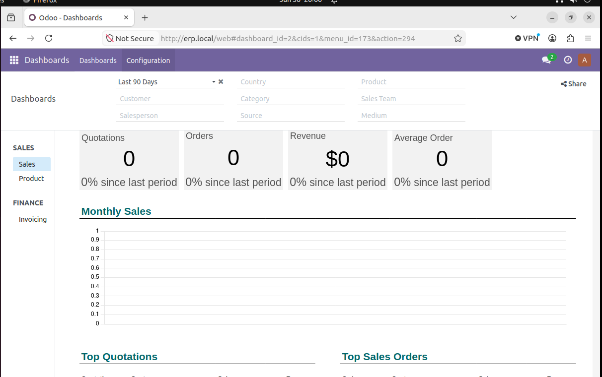
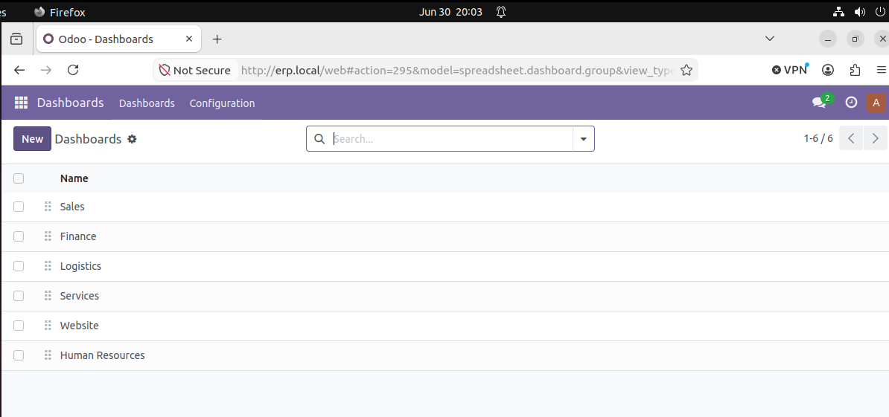

# Test de sélection DevOps — Stack Odoo conteneurisée

## Prérequis
- Docker Engine v24+
- Docker Compose v2+
- Git v2+
- 4 Go RAM minimum, 5 Go disque libre

## Démarrage rapide (5 commandes)

```bash
git clone <url-du-depot>
cd test-selection-devops/apps
cp .env.example .env    # puis éditer .env avec vos propres valeurs
docker compose up -d
```

Ajouter ensuite l'entrée suivante dans `/etc/hosts` :
```
127.0.0.1 erp.local
```

Accéder à Odoo via : **http://erp.local**

## Structure du projet

```
test-selection-devops/
├── apps/
│   ├── docker-compose.yml   # Stack Odoo + PostgreSQL + Nginx
│   ├── .env.example         # Variables d'environnement à copier
│   ├── backup.sh            # Script de sauvegarde automatisé
│   └── nginx/odoo.conf      # Config du reverse proxy
├── docs/
│   ├── restauration.md      # Runbook de restauration après crash
│   ├── journal-ia.md        # Journal d'utilisation de l'IA
│   └── screenshots/         # Captures d'écran des livrables
└── README.md
```

## Sauvegarde

Lancer une sauvegarde manuelle :
```bash
./apps/backup.sh
```

Le script génère une archive `backup_YYYYMMDD_HHMMSS.tar.gz` dans `/backup/`,
contenant le dump PostgreSQL et le filestore Odoo. Les logs sont écrits dans
`/var/log/backup.log`.

Une sauvegarde automatique est planifiée chaque nuit à 02h00 via cron :
```bash
crontab -l   # pour vérifier l'entrée
```

## Restauration après crash

Voir la procédure détaillée dans [`docs/restauration.md`](docs/restauration.md).

## Sécurité

- Utiliser `.env.example` comme modèle pour créer votre propre `.env`.

## Captures d'écran

### Odoo accessible via erp.local (reverse proxy Nginx)


### Module Sales installé


### Module Sales toujours présent après redémarrage (persistance des données)


### Scénario de crash & restauration

Le détail complet du scénario (backup, destruction des volumes, restauration
de la base de données et du filestore), avec une capture pour chaque étape,
est documenté dans [`docs/restauration.md`](docs/restauration.md).
