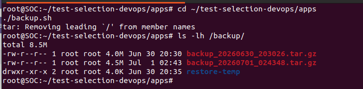
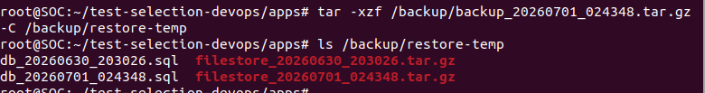
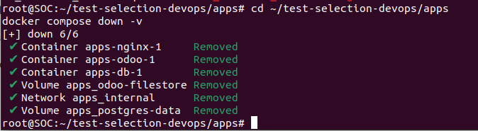
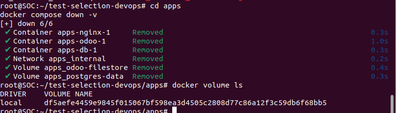
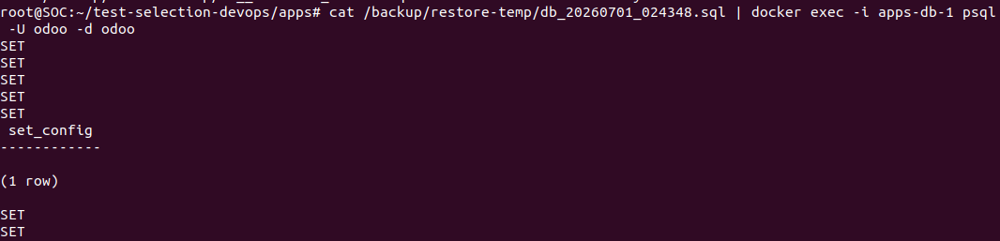
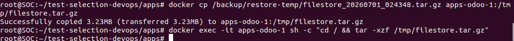
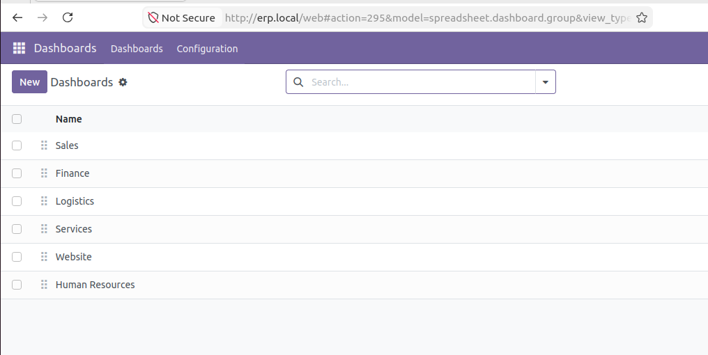

# Runbook — Restauration après crash

## Contexte
Cette procédure permet de restaurer la stack Odoo (base de données + filestore)
depuis une archive de backup, après une perte totale des conteneurs et volumes Docker.

## Prérequis
- Une archive de backup présente dans `/backup/backup_YYYYMMDD_HHMMSS.tar.gz`
- Docker et Docker Compose installés
- Le fichier `docker-compose.yml` du projet, dans le dossier `apps/`

---

## Étapes de restauration

### 1. Créer un backup (si pas déjà fait)

```bash
cd apps
./backup.sh
ls -lh /backup/
```

Le script génère une archive `backup_YYYYMMDD_HHMMSS.tar.gz` contenant le dump
PostgreSQL et le filestore Odoo.



---

### 2. Extraire l'archive de backup

```bash
mkdir -p /backup/restore-temp
tar -xzf /backup/backup_YYYYMMDD_HHMMSS.tar.gz -C /backup/restore-temp
ls /backup/restore-temp
```

Cela génère deux fichiers : `db_YYYYMMDD_HHMMSS.sql` et `filestore_YYYYMMDD_HHMMSS.tar.gz`.



---

### 3. Simuler le crash (destruction des conteneurs et des volumes)

```bash
docker compose down -v
```

⚠️ Cette commande supprime **conteneurs ET volumes** — toutes les données actuelles
sont perdues. C'est le but de l'exercice : prouver qu'on peut tout reconstruire
depuis un backup.



---

### 4. Vérifier que le crash est réel

```bash
docker volume ls
```

Les volumes `apps_postgres-data` et `apps_odoo-filestore` ne doivent plus apparaître
dans la liste.



---

### 5. Redémarrer la stack et recréer la base de données

```bash
docker compose up -d
docker compose ps
```

Les 3 services (`db`, `odoo`, `nginx`) doivent être en `Up`, mais sans aucune donnée.
Le volume PostgreSQL étant vide, la base `odoo` n'existe plus — il faut la recréer
avant de pouvoir y restaurer le dump :

```bash
docker exec -it apps-db-1 createdb -U odoo odoo
```

---

### 6. Restaurer le dump SQL

```bash
cat /backup/restore-temp/db_YYYYMMDD_HHMMSS.sql | docker exec -i apps-db-1 psql -U odoo -d odoo
```

Cette commande rejoue toutes les instructions SQL du dump (`CREATE TABLE`,
`INSERT INTO`, etc.) directement dans la base `odoo` fraîchement créée.



---

### 7. Restaurer le filestore

```bash
docker cp /backup/restore-temp/filestore_YYYYMMDD_HHMMSS.tar.gz apps-odoo-1:/tmp/filestore.tar.gz
docker exec -it apps-odoo-1 sh -c "cd / && tar -xzf /tmp/filestore.tar.gz"
docker exec -it apps-odoo-1 ls -la /var/lib/odoo/filestore

```



---

### 8. Vérification finale

- Aller sur `http://erp.local`
- Se connecter à Odoo
- Vérifier que le module Sales est installé et que les données (clients, produits,
  devis) sont présentes



---


## Notes

- Le nom des conteneurs (`apps-db-1`, `apps-odoo-1`) peut varier selon la machine :
  vérifier avec `docker compose ps` avant de lancer les commandes.
- Ne jamais restaurer un dump sur une base contenant déjà des données de production
  sans confirmation préalable.
- En cas d'erreur `No route to host` entre Odoo et PostgreSQL après un redémarrage,
  relancer simplement `docker compose down` puis `docker compose up -d` — un souci
  réseau Docker temporaire en est généralement la cause.
